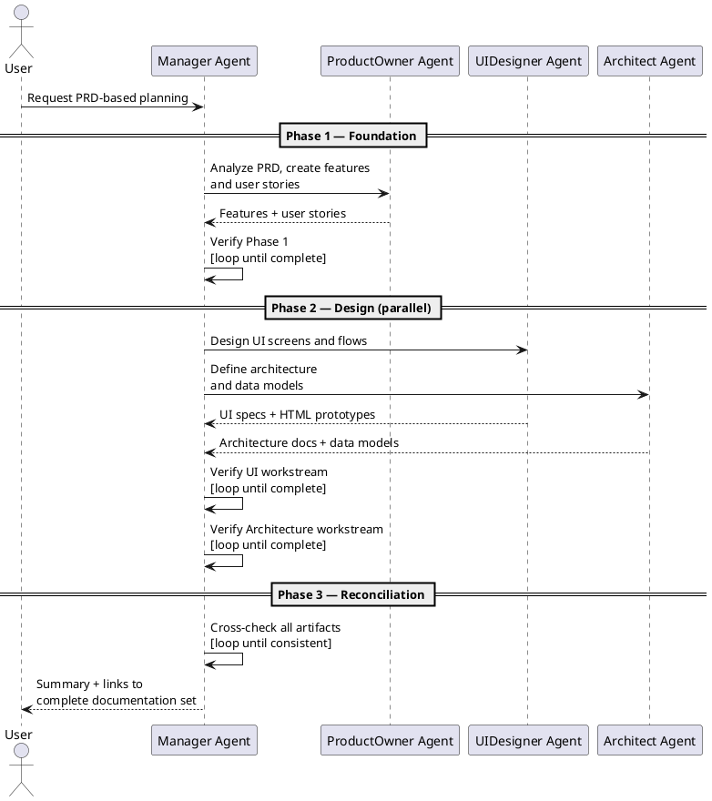

# High Level Planning Skill

When invoked, the Manager autonomously drives the entire process from PRD analysis through to a fully cross-referenced documentation set — with no user intervention required. Control returns to the user only after all phases complete, or if a hard blocker is reached.

## Execution rules

- Run the three phases below as a continuous, autonomous pipeline.
- Each phase has its own correction loop: verify the phase outcome, delegate corrections to the responsible specialist, and re-verify before advancing. Do not skip to the next phase while the current phase has unresolved gaps.
- If a correction loop does not resolve after two iterations, stop and report the blocker to the user with specific detail.
- Never ask the user for confirmation between phases.

---

## Phase 1 — Foundation (ProductOwner)

**Goal:** a complete, well-structured set of features and user stories derived from the PRD.

**Delegate to ProductOwner:**
- Read the PRD file from the project root (treat as read-only).
- Produce all features and user stories following the active `features-and-userstories` skill conventions.

**Manager verifies — correction loop:**
- Every feature identified in the PRD has a corresponding feature folder and at least one user story.
- Trigger targeted corrections to ProductOwner for any gap; re-verify after each correction. Advance only when all checks pass.

---

## Phase 2 — Design (UIDesigner + Architect, in parallel)

**Goal:** complete UI specifications and a complete technical architecture, both grounded in the feature set from Phase 1. These two workstreams do not depend on each other and must run simultaneously.

### UIDesigner workstream

**Delegate to UIDesigner:**
- Design all necessary UI screens and flows for the features and user stories from Phase 1, following the active `ui-design` skill conventions.

**Manager verifies — correction loop:**
- Every feature with a UI interaction has at least one associated screen.
- `Documentation/UI/ProjectDesignDirectives.md` is present and up to date.
- Trigger targeted corrections to UIDesigner for any gap; re-verify after each correction.

### Architect workstream

**Delegate to Architect:**
- Define the technical architecture and data models for the features and user stories from Phase 1, following the active `high-level-architecture`, `backend-architecture`, `frontend-architecture` and `data-models` skill conventions.

**Manager verifies — correction loop:**
- All expected architecture documents exist and are non-empty.
- Major decisions and open questions are explicitly stated.
- Trigger targeted corrections to Architect for any gap; re-verify after each correction.

---

## Phase 3 — Reconciliation (Manager)

**Goal:** the full documentation set is internally consistent across all workstreams (PRD, features/stories, UI, architecture).

**Manager runs the following checks and iterates until all pass:**
- Every feature identified in the PRD has a corresponding feature folder and user stories.
- Every user story that implies a UI interaction has at least one associated UI screen.
- Every UI screen references the correct feature and user story identifiers.
- The architecture documents are consistent with the feature set, user stories, and UI design.
- `ProjectDesignDirectives.md` is in sync with the actual UI folders and files.

**On failure:** delegate targeted corrections to the responsible specialist (ProductOwner, UIDesigner, or Architect), specifying exactly what is inconsistent and what the expected state is. Re-run all checks after corrections. After two full correction iterations without resolution, stop and report remaining conflicts to the user.

**On success:** return a consolidated summary to the user listing all created and updated documents, with links.

---

## Workflow Diagram

