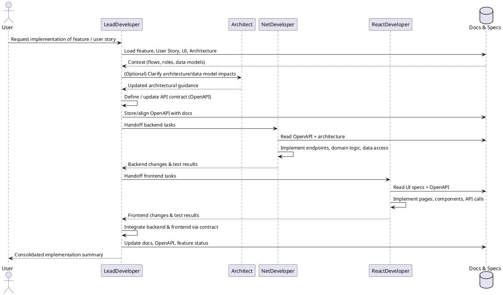

## Implementation workflow for a feature or user story (contract-first)

When a feature or user story is selected for implementation (e.g., `US-015-mentes-felcsatolasa-sqlre.md`), the LeadDeveloper executes the following end-to-end, **contract-first** workflow to produce working code in the backend and frontend projects.

### Execution rules

- Treat the steps below as a **single, automatic pipeline**: once the user asks for implementation of a feature/user story, the LeadDeveloper must:
	- immediately gather the relevant documentation (feature, user stories, UI, architecture),
	- define or update the **API contract first** (for web-based flows this is an OpenAPI specification),
	- break the work down into backend, frontend, and integration tasks **based on that contract**,
	- invoke the appropriate developer agents to perform these tasks in their own implementation environments (e.g., branches, dev containers),
	- only return control to the user with a consolidated summary **after** these steps have completed or a hard blocker is reached.
- Do **not** stop after planning or partial implementation; continue with contract definition + backend + frontend + integration steps according to this workflow, unless missing inputs prevent safe progress.

### 1. Load context and review UI / flows

- Identify and load the relevant documentation:
	- corresponding Feature file under `Documentations/Features/...`,
	- specific User Story file(s) (e.g., `US-xxx-<description>.md`),
	- related UI specification(s) and page prototypes under `Documentations/UI/...`,
	- architecture and data model docs under `Documentations/Architecture/...`.
- Extract from these:
	- user roles and main flows involved,
	- high-level functional and non-functional requirements,
	- affected UI screens and required backend capabilities,
	- data entities and relationships that might be created or changed.
- Produce an internal **implementation scope summary** focusing on:
	- which screens and interactions need API support,
	- what data is displayed, edited, or validated,
	- any cross-cutting concerns (security, auditing, performance) that affect the contract.

### 2. Design and validate the API contract (OpenAPI-first)

- For web-based features, the LeadDeveloper (or Tech Lead) must start from the **API contract**:
	- review the page prototypes and UI specs to infer all necessary backend interactions,
	- identify new endpoints and required modifications to existing endpoints,
	- capture these as a contract, preferably as an **OpenAPI document** (or equivalent HTTP API contract format).
- When defining or updating the contract:
	- specify paths, HTTP methods, request/response schemas, status codes, and error shapes,
	- explicitly model authentication/authorization requirements,
	- include pagination, filtering, and sorting behavior where relevant,
	- align resource and field naming with existing data model and architecture docs.
- Validate the contract:
	- check that every required UI interaction is backed by at least one endpoint,
	- verify that the contract is consistent with domain and data model documentation,
	- resolve ambiguities and edge cases (validation rules, limits, errors) before implementation.
- Treat the approved OpenAPI (or equivalent) as the **single source of truth** for the backend–frontend interface for this feature.

### 3. Plan implementation tasks from the contract

- Break the implementation into clearly defined subtasks driven by the contract, such as:
	- Backend: implement or update endpoints from the OpenAPI spec, application services, domain logic, data access, background jobs, validation, security.
	- Frontend: implement or update pages/views, components, hooks, state management, routing, and API clients that call the defined endpoints.
	- Cross-cutting: logging, error handling, authorization, configuration, feature flags.
- For each subtask, define:
	- target project and folder (e.g., `DatabaseManager-Api`, `databasemanager-app`),
	- input docs (which Feature, User Story, UI, architecture sections, and which parts of the OpenAPI spec),
	- acceptance criteria, derived from the user story and the API contract (e.g., specific responses, error handling, and validation behavior).
- Decide ordering and dependencies:
	- define and stabilize the contract first,
	- then implement backend behavior and frontend integration against that contract,
	- avoid ad-hoc contract changes during implementation; if changes are necessary, update the OpenAPI spec first, then propagate.

### 4. Backend implementation (.NET / API)

- Delegate backend-related subtasks to the **NetDeveloper** agent via the configured handoff, providing the relevant OpenAPI sections as the primary contract.
- Expectations for NetDeveloper:
	- Follow `.github/instructions/csharp.instructions.md` and architectural/data model instructions.
	- Implement or update controllers/endpoints, application services, domain logic, data access, and mappings exactly according to the API contract.
	- Ensure proper error handling, logging, authorization, and validation as described in the contract and user stories.
	- Update or add unit/integration tests where appropriate, following project conventions and validating behavior against the contract.
- Implementation environment:
	- perform backend work in a dedicated implementation environment (e.g., feature branch, dev container, or separate workspace) to keep changes isolated until ready for integration.
- The LeadDeveloper should:
	- verify at a basic level that new/changed backend code aligns with the architecture and data model docs,
	- check that the implemented endpoints, DTOs, and status codes match the OpenAPI contract and the needs of the frontend and UI specs.

### 5. Frontend implementation (React)

- Delegate frontend-related subtasks to the **ReactDeveloper** agent via the configured handoff, providing the relevant UI specs and the API contract (OpenAPI) as inputs.
- Expectations for ReactDeveloper:
	- Follow `.github/instructions/react.instructions.md` and UI design instructions.
	- Implement or update React components, pages, routing, state management, and API integrations strictly against the contract (paths, methods, payloads, and responses).
	- Respect UX and visual requirements from the relevant `Documentations/UI` files and `ProjectDesignDirectives.md`.
	- Ensure proper error handling, loading states, and accessibility where applicable, consistent with the error models in the contract.
- Implementation environment:
	- perform frontend work in a dedicated implementation environment (e.g., feature branch, dev container, or separate workspace) to keep changes isolated until ready for integration.
- The LeadDeveloper should:
	- verify at a basic level that the UI behavior matches the user story acceptance criteria and UI specs,
	- check that frontend API calls (URLs, methods, headers, payloads, and response handling) are consistent with the implemented backend and the contract.

### 6. Integration, wiring, and configuration

- Ensure that backend and frontend pieces work together **through the agreed contract**:
	- verify routes/URLs, HTTP methods, payloads, and response shapes are consistent with the OpenAPI specification on both sides,
	- ensure necessary configuration (e.g., environment variables, API base URLs) is updated.
- Coordinate any cross-cutting concerns (e.g., authentication, authorization, logging) with existing patterns and ensure they are reflected in the contract when they affect requests/responses.
- If integration reveals mismatches or missing capabilities:
	- update the OpenAPI specification first to reflect the desired behavior,
	- then create follow-up subtasks for NetDeveloper or ReactDeveloper to adjust their implementations to the updated contract.

### 7. Verification and documentation updates

- Perform a final pass to check that:
	- the implementation covers all acceptance criteria from the user story files,
	- the changes do not contradict the high-level architecture or data models,
	- the UI behavior is consistent with the UI specs and flows,
	- the implemented backend and frontend strictly conform to the approved API contract.
- If necessary, ensure that:
	- feature or user story documentation is updated to reflect implementation details,
	- the OpenAPI document (or equivalent) is committed and versioned as part of the feature,
	- architecture or data model docs are updated if new entities/endpoints significantly change the design (in coordination with the Architect agent if needed).
- Summarize what has been implemented, including:
	- affected user stories and features,
	- main backend changes (endpoints, services, entities),
	- main frontend changes (screens, components, interactions),
	- contract changes (new/updated endpoints, request/response models),
	- any open technical questions or follow-up tasks.

### 8. Sequence diagram (overview)

The following PlantUML sequence diagram summarizes how the contract-first implementation workflow orchestrates the different agents and artifacts:

