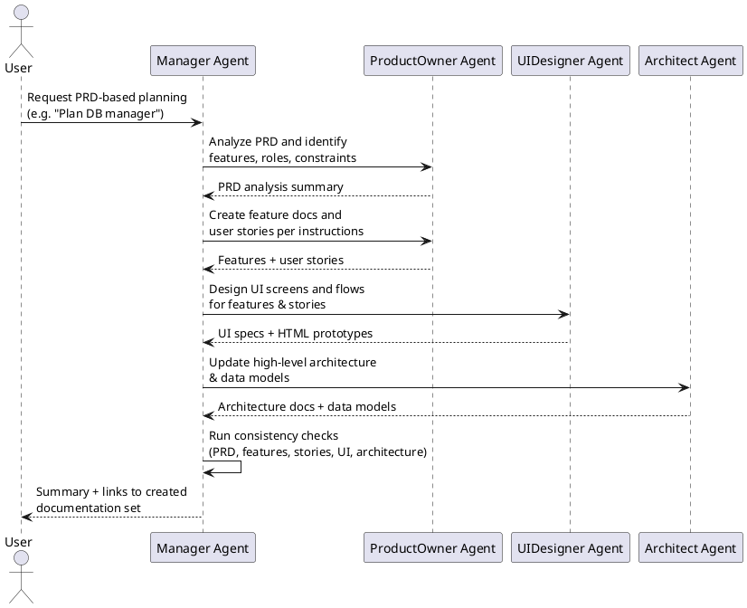

## PRD Planning Workflow

When a PRD file appears or is updated in the project root (e.g., `PRD_Database_manager.md`), the Manager executes the following, well-defined sequence of steps to create a complete implementation documentation set.

### Execution rules

- Treat the steps below (1–6) as a **single, automatic pipeline**: once the user asks for PRD-based planning, the Manager must:
	- immediately invoke the appropriate sub-agents,
	- drive them through all relevant steps (PRD analysis, feature creation, user story generation, UI planning, and checks according to this workflow),
	- only return control to the user with a consolidated summary **after** these steps have completed or a hard blocker is reached.
- Do **not** pause after step 1 (PRD analysis) waiting for more instructions; instead, continue with feature creation, user story generation, UI planning, and checks according to this workflow.

### 1. Load PRD and Define Scope

- Load the PRD file from the project root (as read-only input).
- Delegate PRD analysis to the ProductOwner agent with the expectation that they identify:
	- business goals and problems,
	- user roles / user types,
	- main feature groups (future features),
	- important constraints and non-functional requirements.
- Expect back a brief, informal summary (feature list + main user types) that subsequent automated steps can build on.

### 2. Create Features (Documentations/Features)

- Immediately after receiving the PRD analysis result, assign a subtask to the ProductOwner agent to create **features** from the feature groups extracted from the PRD
	according to `.github/instructions/Features_Userstories.instructions.md`.
- Record expectations that:
	- each feature gets its own folder under `Documentations/Features`,
	- the folder contains a `[FeatureName].md` descriptive file,
	- the feature file includes a short description, a list reserved for related user stories, and
		(if relevant) feature-level acceptance criteria.
- Verify at a basic level that a separate feature folder and descriptive file exist for every main function identified in the PRD; if something is missing, immediately create a corrective subtask for the ProductOwner agent.

### 3. Generate User Stories for Features

- After feature folders exist, assign another subtask to the ProductOwner agent: create a **user story** collection from use cases
	identified in the PRD and feature descriptions.
- Explicit expectations:
	- one use case = one user story file within the appropriate feature folder,
	- file naming convention: `US-xxx-<brief-description>.md`,
	- content template: "As a [user role], I want to [goal] so that [reason]." + acceptance criteria list,
	- the feature's main `.md` file should contain references to the user stories belonging to that feature.
- The Manager verifies that:
	- each feature has associated user stories,
	- they conform to the `Features_Userstories.instructions.md` format;
	- if gaps or format issues are detected, the Manager automatically triggers follow-up subtasks to the ProductOwner agent to fix them before proceeding to UI design.

### 4. UI Screens and Flows (Documentations/UI)

- Delegate the task to the UIDesigner agent to define all necessary **UI screens and user flows** based on the PRD
	and the created user stories, without waiting for explicit user confirmation.
- Specific expectations for the UIDesigner based on `.github/instructions/UI_Design.Instructions.md`:
	- each UI screen / flow receives a unique identifier (e.g., `UI-001`, `UI-002`, ...),
	- each UI identifier gets its own subfolder under `Documentations/UI`
		(e.g., `Documentations/UI/UI-001-login-screen/`),
	- the subfolder contains an MD specification (functional + UX description) and an HTML prototype
		(e.g., `UI-001-login-screen.md` and `UI-001-login-screen.html`).
- Expect the UI MD files to reference relevant features and user stories
	(in the form of identifiers and file references).
- The UIDesigner is responsible for maintaining the `Documentations/UI/ProjectDesignDirectives.md` file, containing a
	summary table that shows:
	- feature → associated UI identifiers,
	- user story → associated UI screens / flows.

### 5. Technical Architecture (Architect Agent)

- Delegate a dedicated subtask to the Architect agent to **define or update the high-level technical architecture**
	whenever a PRD-based planning workflow introduces new features or changes that may impact the system design.
- Instruct the Architect to:
	- follow `.github/instructions/HighLevelArchitecture.instructions.md`, `.github/instructions/DataModels.instructions.md`, and their own agent rules,
	- work primarily in `Documentations/Architecture/architecture.md`, keeping it aligned with:
		- the PRD (`PRD_Database_manager.md`),
		- feature and user story docs under `Documentations/Features`,
		- and the UI design docs under `Documentations/UI`.
	- maintain `Documentations/Architecture/DataModels.md` and `Documentations/Architecture/DataModels.puml` so that the persisted data model is documented and consistent with the overall architecture.
- Expect the Architect to cover at least:
	- purpose and scope of the architecture update,
	- architectural overview and runtime context,
	- backend and frontend logical structure related to the new/changed features,
	- data model/storage implications,
	- security, compliance, and operational concerns at a high level.
- Require that major architecture decisions, assumptions, and open questions are clearly documented so that
	implementation-focused agents can safely continue from them.

### 6. Cross-References and Consistency Checks

- After the ProductOwner, UIDesigner, and Architect have completed their artifacts, the Manager
	performs a consistency check:
	- every main function identified in the PRD has its own feature under `Documentations/Features`,
	- every feature has associated user stories in the correct format,
	- every relevant user story has at least one associated UI screen / flow (if the function requires UI),
	- the high-level architecture in `Documentations/Architecture/architecture.md` is consistent with the PRD,
		features, user stories, and UI design,
	- the `ProjectDesignDirectives.md` table is in sync with the actual UI folders and files.
- If inconsistencies, conflicts, or contradictions are found, the Manager provides targeted feedback to the
	ProductOwner or UIDesigner agent (what needs to be added / modified, in which folder, in what format).

### 7. Automated Workflow View

- When detecting new or modified PRD, the Manager automatically:
	- starts the PRD analysis and scoping step (step 1),
	- then, **without user intervention**, generates and executes subtasks for ProductOwner, UIDesigner, and Architect agents for steps 2–5 based on extracted information,
	- optionally involves additional technical / Architect agents while considering
		`.github/instructions/HighLevelArchitecture.instructions.md`, especially for architecture-impacting features,
	- finally performs the consistency checks in step 6.
- At the end of the process, the Manager is responsible for ensuring a **complete, cross-referenced**
	feature, user story, UI documentation set, and (where applicable) updated high-level architecture are available in the project before responding back to the user.
---
